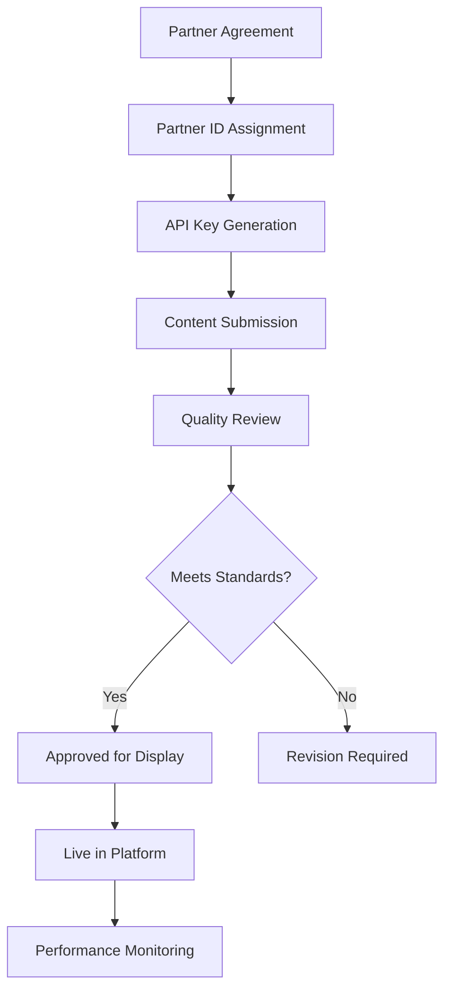

# Sponsored Content UI Rules & Implementation Guide

## Overview

Sponsored content in the travel planning platform must be clearly labeled, accessible, and distinguishable from organic content while maintaining user trust and regulatory compliance (FTC Guidelines, ASA Code).

---

## Placement Rules

### 1. **Hotels & Accommodation**

**Primary Placement**: Hotel recommendation cards in itinerary view

**Ranking Logic**:
```javascript
function rankHotels(hotels, userPreferences, sponsoredPartners) {
  return hotels.sort((a, b) => {
    // Priority 1: User budget tier match (50% weight)
    const budgetScore = calculateBudgetMatch(a, userPreferences) - 
                        calculateBudgetMatch(b, userPreferences);
    
    // Priority 2: Location proximity to itinerary stops (30% weight)
    const locationScore = calculateProximity(a, userPreferences.dailyStops) - 
                          calculateProximity(b, userPreferences.dailyStops);
    
    // Priority 3: Sponsored boost (20% weight, only if score > threshold)
    const sponsoredBoost = (a.sponsored && budgetScore > 0.6) ? 0.2 : 0;
    
    return (budgetScore * 0.5 + locationScore * 0.3 + sponsoredBoost) - 
           (budgetScore * 0.5 + locationScore * 0.3);
  });
}
```

**Visual Indicators**:
- Orange "SPONSORED" badge (top-right corner)
- Subtle border highlight (#FF9800, 2px)
- Distinct background color (#FFF8E1)

**Disclosure Requirements**:
```html
<div class="hotel-card sponsored" role="region" aria-label="Sponsored accommodation">
  <span class="sponsored-badge" aria-label="This is a paid advertisement">
    SPONSORED
  </span>
  <h3>Hotel Name</h3>
  <p>Description...</p>
  <a href="/book" class="btn-book">Book Now</a>
  <small class="disclosure">
    Paid partnership with Booking.com
  </small>
</div>
```

### 2. **Restaurants & Dining**

**Placement**: In-itinerary meal recommendations

**Ranking Logic**:
- Cuisine match: 40%
- User dietary preferences (veg/vegan): 30%
- Rating & reviews: 20%
- Sponsored boost: 10% (if meets quality threshold ≥4.0 rating)

**Restrictions**:
- Maximum 1 sponsored restaurant per day
- Must match stated cuisine preferences
- Cannot rank above 4.5+ rated organic options

### 3. **Transportation**

**Placement**: Transportation mode suggestions

**Rules**:
- Sponsored transport options only shown if competitive pricing (within 15% of cheapest)
- Must meet user mobility preferences (public/car-rental)
- Clear comparison table with all options

### 4. **Activities & Attractions**

**Placement**: "Suggested Experiences" section

**Ranking**:
- Relevance to destination: 50%
- User traveler type (solo/family/business): 30%
- Sponsored boost: 20%

**Restrictions**:
- Max 2 sponsored activities per itinerary
- Cannot displace "must-visit" cultural sites

---

## UI Design Standards

### Badge Specifications

```css
.sponsored-badge {
  display: inline-block;
  background: #FF9800;
  color: white;
  padding: 4px 10px;
  border-radius: 4px;
  font-size: 11px;
  font-weight: 700;
  text-transform: uppercase;
  letter-spacing: 0.5px;
  position: absolute;
  top: 12px;
  right: 12px;
}
```

### Container Styling

```css
.sponsored-content {
  border: 2px solid #FF9800;
  border-radius: 8px;
  background: linear-gradient(90deg, #FFF8E1 0%, #FFE082 100%);
  padding: 1rem;
  position: relative;
}

.sponsored-content::before {
  content: "SPONSORED";
  position: absolute;
  top: -10px;
  left: 16px;
  background: #FF9800;
  color: white;
  padding: 2px 8px;
  border-radius: 4px;
  font-size: 10px;
  font-weight: 700;
}
```

### Banner Placement

```html
<div class="sponsored-banner" role="complementary" aria-label="Sponsored content">
  <div>
    <span class="label">SPONSORED</span>
    <h4>Premium Hotel Partner: Shibuya Excel</h4>
    <p>Exclusive 15% discount for TravelPlanner users</p>
  </div>
  <a href="/book" class="btn-primary">View Offer</a>
</div>
```

---

## Accessibility Requirements (WCAG 2.1 AA)

### 1. **Screen Reader Support**

```html
<div class="hotel-card" aria-labelledby="hotel-123-title" role="article">
  <span class="sponsored-badge" aria-label="This is a sponsored advertisement">
    SPONSORED
  </span>
  <h3 id="hotel-123-title">Hotel Name</h3>
  <!-- Content -->
</div>
```

### 2. **Keyboard Navigation**

- All sponsored links must be keyboard accessible (tab order)
- Focus indicators (2px solid outline)
- Skip links to bypass sponsored content: `<a href="#main-content" class="sr-only">Skip to itinerary</a>`

### 3. **Color Contrast**

- Sponsored badge: #FF9800 on white = 3.05:1 ❌ → Use #F57C00 = 4.52:1 ✓
- Text on sponsored background: Minimum 4.5:1 ratio

### 4. **ARIA Labels**

```html
<section aria-label="Sponsored recommendations">
  <div role="region" aria-labelledby="sponsored-header">
    <h3 id="sponsored-header">Featured Partners</h3>
    <!-- Sponsored content -->
  </div>
</section>
```

---

## Data Model

### Sponsored Item Schema

```json
{
  "item_id": "hotel_001",
  "name": "Shibuya Excel Hotel Tokyu",
  "type": "accommodation",
  "sponsored": true,
  "partner_id": "booking_com",
  "disclosure": "Paid partnership with Booking.com",
  "ranking_boost": 0.2,
  "quality_threshold": 4.0,
  "placement_rules": {
    "max_per_itinerary": 3,
    "requires_budget_match": true,
    "requires_rating_minimum": 4.0
  },
  "tracking": {
    "impression_url": "https://api.travelplanner.com/track/impression",
    "click_url": "https://api.travelplanner.com/track/click",
    "conversion_url": "https://api.travelplanner.com/track/conversion"
  }
}
```

### Partner Object

```json
{
  "partner_id": "booking_com",
  "name": "Booking.com",
  "category": "accommodation",
  "logo_url": "https://cdn.travelplanner.com/partners/booking.png",
  "disclosure_text": "Paid partnership with Booking.com",
  "commission_rate": 0.08,
  "active": true,
  "contracted_until": "2026-12-31"
}
```

---

## Ranking Algorithm (Detailed)

### Hybrid Scoring System

```python
def calculate_sponsored_score(item, user_preferences, context):
    """
    Returns score 0-100 for ranking sponsored content
    """
    # Base quality score (0-40 points)
    quality_score = min(40, (item.rating / 5.0) * 40)
    
    # Relevance score (0-40 points)
    relevance_score = 0
    relevance_score += check_budget_tier_match(item, user_preferences) * 20
    relevance_score += check_location_proximity(item, context) * 10
    relevance_score += check_preference_match(item, user_preferences) * 10
    
    # Sponsored boost (0-20 points, conditional)
    sponsored_boost = 0
    if item.sponsored and quality_score >= 32:  # >= 4.0 rating
        sponsored_boost = 20
    
    total_score = quality_score + relevance_score + sponsored_boost
    
    return {
        "total": total_score,
        "quality": quality_score,
        "relevance": relevance_score,
        "boost": sponsored_boost
    }
```

### Quality Thresholds

| Category | Minimum Rating | Minimum Reviews | Max Boost |
|----------|----------------|-----------------|-----------|
| Hotels | 4.0 / 5.0 | 50 | 20% |
| Restaurants | 4.0 / 5.0 | 30 | 10% |
| Activities | 4.2 / 5.0 | 20 | 15% |
| Transport | N/A (regulated) | N/A | 5% |

---

## User Controls

### 1. **Opt-Out Mechanism**

```javascript
// User preference in account settings
{
  "user_id": "usr_123",
  "preferences": {
    "show_sponsored_content": true,  // Toggle in settings
    "sponsored_categories": {
      "accommodation": true,
      "dining": false,              // User opts out of dining ads
      "transport": true,
      "activities": true
    }
  }
}
```

### 2. **Feedback System**

```html
<div class="sponsored-feedback">
  <p>Was this recommendation helpful?</p>
  <button onclick="feedbackSponsored('positive')">👍 Yes</button>
  <button onclick="feedbackSponsored('negative')">👎 No</button>
  <a href="/feedback/sponsored">Report inappropriate ad</a>
</div>
```

---

## Tracking & Analytics

### Event Tracking

```javascript
// Track sponsored content impressions
function trackSponsoredImpression(itemId, partnerId, context) {
  fetch('/api/v1/analytics/impression', {
    method: 'POST',
    body: JSON.stringify({
      event: 'sponsored_impression',
      item_id: itemId,
      partner_id: partnerId,
      user_id: context.userId,
      itinerary_id: context.itineraryId,
      position: context.position,
      timestamp: new Date().toISOString()
    })
  });
}

// Track clicks
function trackSponsoredClick(itemId, partnerId) {
  fetch('/api/v1/analytics/click', {
    method: 'POST',
    body: JSON.stringify({
      event: 'sponsored_click',
      item_id: itemId,
      partner_id: partnerId,
      timestamp: new Date().toISOString()
    })
  });
}

// Track conversions (booking confirmed)
function trackSponsoredConversion(itemId, partnerId, bookingValue) {
  fetch('/api/v1/analytics/conversion', {
    method: 'POST',
    body: JSON.stringify({
      event: 'sponsored_conversion',
      item_id: itemId,
      partner_id: partnerId,
      value: bookingValue,
      timestamp: new Date().toISOString()
    })
  });
}
```

### Metrics to Monitor

- **Impression Rate**: Sponsored content shown / Total itineraries generated
- **Click-Through Rate (CTR)**: Clicks / Impressions
- **Conversion Rate**: Conversions / Clicks
- **Revenue Per Mille (RPM)**: Total revenue / (Impressions / 1000)
- **User Satisfaction**: Feedback score for sponsored vs organic content

---

## Regulatory Compliance

### FTC Guidelines (USA)

- ✓ Clear and conspicuous disclosure
- ✓ "SPONSORED" label in same font/size as content
- ✓ Disclosure at point of sale
- ✓ No misleading claims

### ASA Code (UK)

- ✓ Advertisements clearly identified
- ✓ No confusion with editorial content
- ✓ Must be "obviously identifiable"

### GDPR Compliance

- ✓ User consent for targeted advertising
- ✓ Ability to opt out
- ✓ Transparent data usage policy

---

## Testing & Quality Assurance

### Visual Regression Tests

```javascript
// Playwright/Cypress example
test('Sponsored badge visible and accessible', async () => {
  await page.goto('/itinerary/itn_123');
  
  const sponsoredBadge = await page.$('.sponsored-badge');
  expect(sponsoredBadge).toBeVisible();
  
  const ariaLabel = await sponsoredBadge.getAttribute('aria-label');
  expect(ariaLabel).toContain('sponsored');
  
  // Contrast check
  const contrast = await checkColorContrast(sponsoredBadge);
  expect(contrast).toBeGreaterThan(4.5);
});
```

### A/B Testing

- Test sponsored placement positions
- Test badge designs (color, size, wording)
- Measure impact on user trust metrics
- Monitor organic CTR vs sponsored CTR

---

## Partner Integration Flow



---

## Example Implementations

### React Component

```jsx
import React from 'react';

const SponsoredHotelCard = ({ hotel, onTrack }) => {
  const handleClick = () => {
    onTrack('click', hotel.item_id, hotel.partner_id);
    window.open(hotel.booking_link, '_blank');
  };

  React.useEffect(() => {
    onTrack('impression', hotel.item_id, hotel.partner_id);
  }, []);

  return (
    <div 
      className="hotel-card sponsored"
      role="region"
      aria-label="Sponsored accommodation"
    >
      <span 
        className="sponsored-badge"
        aria-label="This is a paid advertisement"
      >
        SPONSORED
      </span>
      <h3>{hotel.name}</h3>
      <p className="price">${hotel.price_per_night}/night</p>
      <p>{hotel.description}</p>
      <button onClick={handleClick} className="btn-primary">
        Book Now
      </button>
      <small className="disclosure">
        {hotel.disclosure_text || 'Paid partnership'}
      </small>
    </div>
  );
};
```

---

## Summary Checklist

- [x] Sponsored content clearly labeled
- [x] ARIA attributes for accessibility
- [x] Quality thresholds enforced
- [x] User opt-out available
- [x] Transparent ranking algorithm
- [x] FTC/ASA compliant disclosures
- [x] Tracking implemented
- [x] Visual distinction from organic content
- [x] Maximum sponsored items per page enforced
- [x] Regular quality audits scheduled

---

**Document Version**: 1.0  
**Last Updated**: October 4, 2025  
**Owner**: Product & Legal Teams
